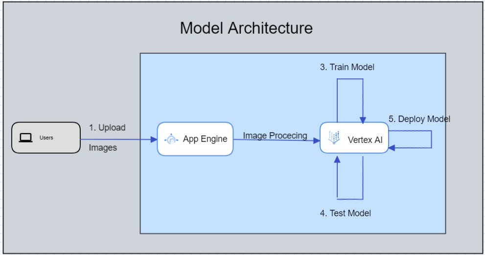

# Api Model

## Model Architecture



## Home Endpoint
  ### Endpoint: `/`
  - Method: GET
  - Description: Returns a success message.
  - Response: Returns a JSON object with a success message.
  - Example:
    - Request:
      - URL: `/`
      - Method: GET
    - Response:
      - Status: 200 OK
      - Body:
        ```json
        {
          "message": "Sukses"
        }
        ```

## Prediction Endpoint
  ### Endpoint: `/predict`
  - Method: POST
  - Description: Performs an image prediction using the provided image file.
  - Request Parameters:
    - `image` (file) - The image file to be used for prediction.
  - Response: Returns the prediction result as received from the API and additional information from the backend.
  - Example:
    - Request:
      - URL: `/predict`
      - Method: POST
      - Headers:
        - Content-Type: multipart/form-data
      - Body: Form data with the `image` parameter containing the image file.
    - Response:
      - Status: 200 OK
      - Body:
        ```json
        {
          "id": 123,
          "name": "Food Name",
          "category": 1,
          "kategori": "Category Name",
          // other food details
        }
        ```

        
